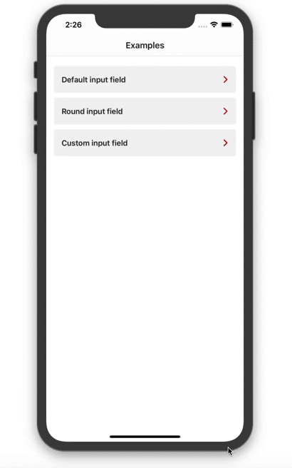

# OTPTextField


## Overview 

This library provides the ability to quickly implement the SMS input field. By default it supports the ability to automatically insert OneTimeCode into the field. 

**Features:**

1. Two default input fields
2. The ability to make your own design
3. Ability to animate an input indicator
4. Ability to handle error state

<p align="center">
	
</p>

## Installation

#### CocoaPods

[CocoaPods](https://cocoapods.org/) is a dependency manager for Cocoa projects. For usage and installation instructions, visit their website. To integrate OTPTextField into your Xcode project using CocoaPods, specify it in your `Podfile`:

```ruby
pod 'OTPTextField', '~> 1.0'
```


## Usage

#### Default Usage 

In order to add a default field: 

1. Create instance of OTPTextField 
2. Add to your ViewController 
3. Implement handlers 

#### Custom Usage 

In order to implement cutom field:

1. Create your own pinView and implement protocol `PinContainer` 
2. Create your own adapter class and implement protocol `OTPTextFieldData`
3. Add instance of OTPTextField to your ViewController 
4. Set your own custom configuration and implement handlers 

```swift
    func configureOtpField() {
        let configuration = OTPFieldConfiguration(adapter: CustomFieldAdapter(),
                                                  keyboardType: .namePhonePad,
                                                  keyboardAppearance: .light,
                                                  autocorrectionType: .no,
                                                  allowedCharactersSet: .alphanumerics)
        otpField.setConfiguration(configuration)
        otpField.onBeginEditing = {
            print("Handle Begin Editing")
        }
        otpField.onEndEditing = {
            print("Handle End Editing")
        }
        otpField.onOTPEnter = { code in
            print("Handle OTP entered action")
        }
        otpField.onTextChanged = { code in
            print("Handle code changing")
        }
    }
```

## License

OTPTextField is released under the MIT license. [See LICENSE](https://github.com/fixique/OTPTextField/blob/master/LICENSE) for details.

 